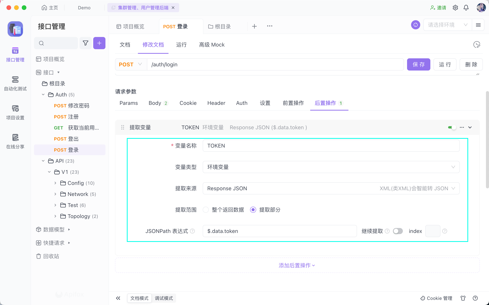
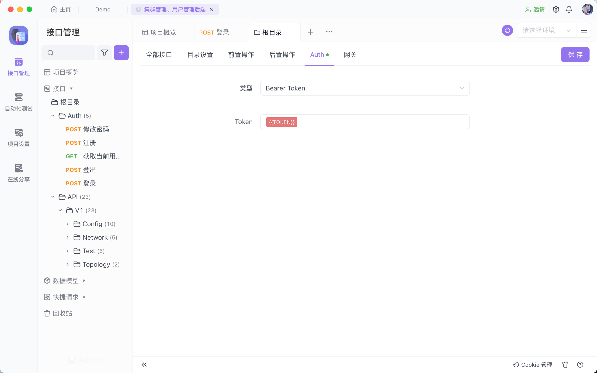
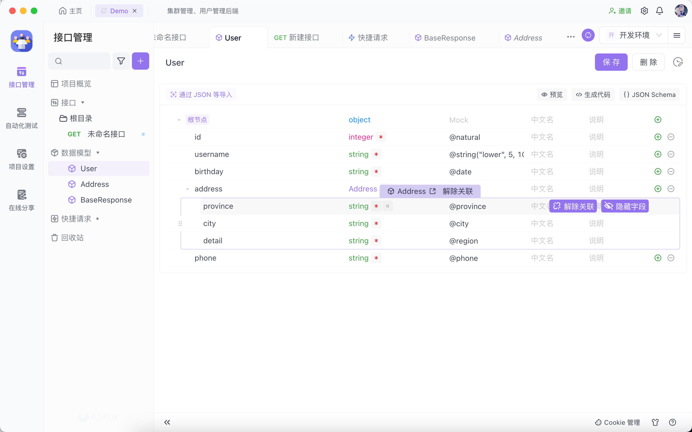
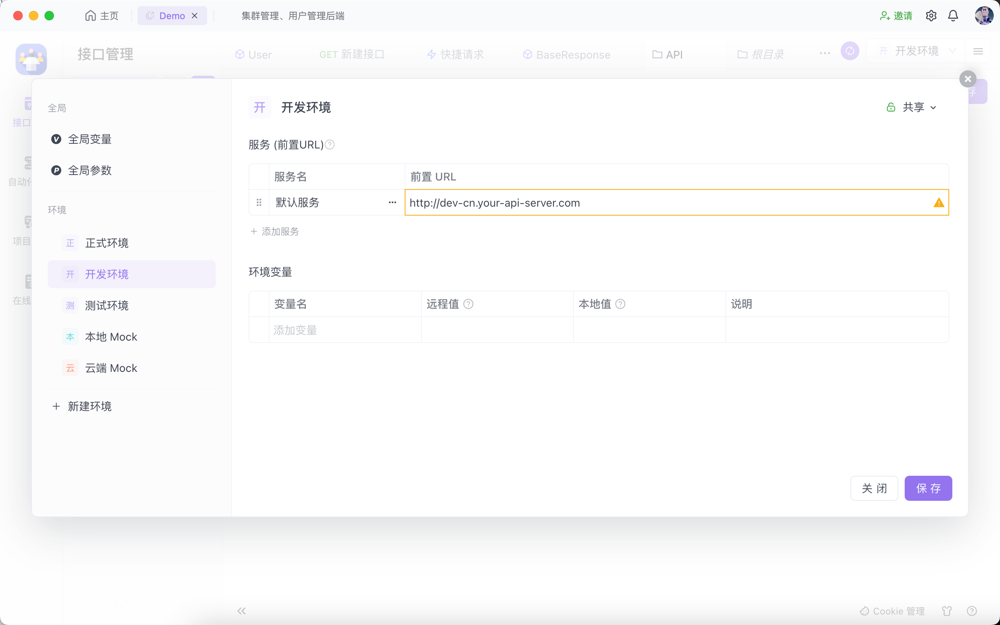
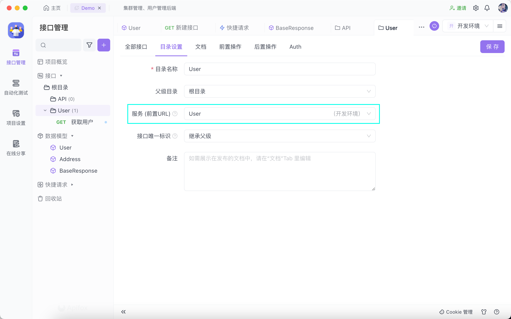
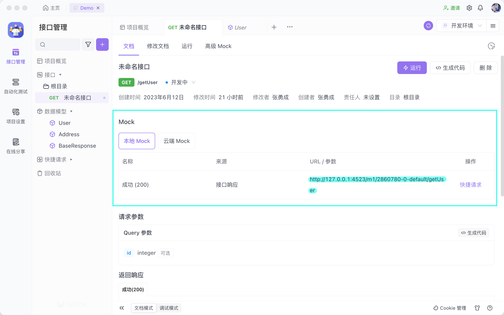
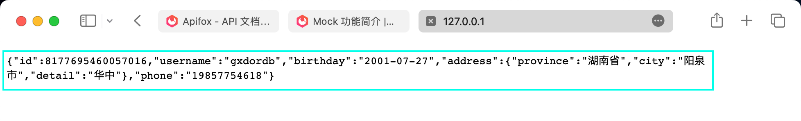
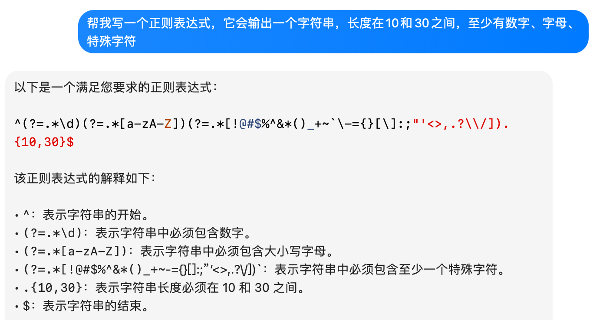
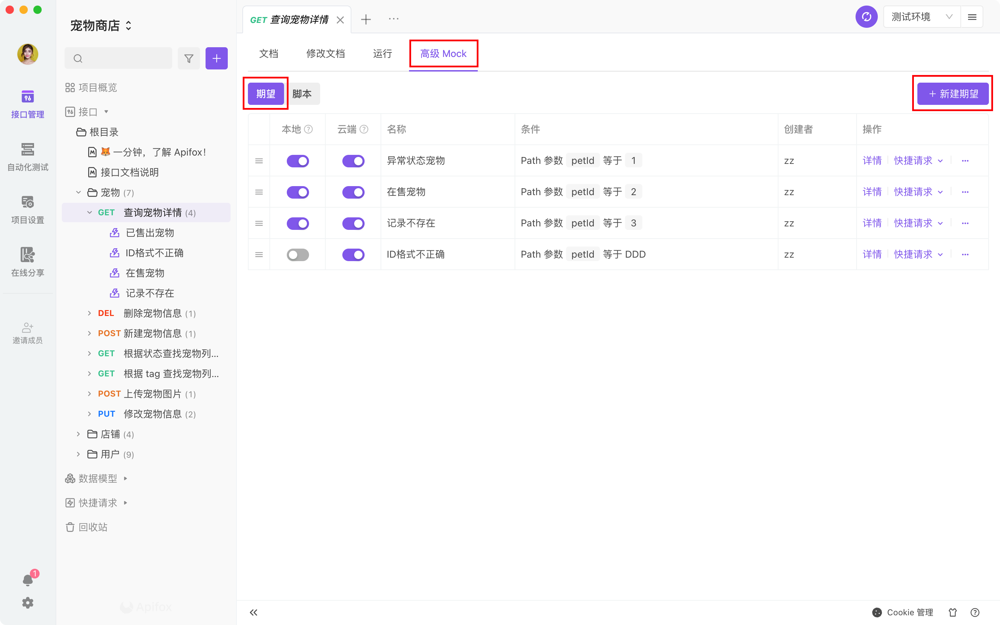

# Apifox简要教程

### 介绍

Apifox是一个API一体化协作平台，包括API设计/开发/测试，换句话说，Apifox = Postman + Swagger + Mock + JMeter。

其中，Apifox的快捷请求功能相当于Postman的功能，在后端接口已经开发完成的情况下，Apifox可以通过快捷请求拿到的数据，转化为接口定义，允许开发者在简要修改的情况下快速生成接口文档。

从过往实践上看，它极低代价地有效避免了前后端扯皮，并且极大方便了前端开发时需要Mock数据，并且在集合测试和性能测试中无需花费过多精力。当然，你会得到一个美观的接口文档。

### 最佳实践

#### 协作流程

1. 前端（或后端）在 Apifox 上定好 **接口文档** 初稿。
2. 前后端一起评审、完善 **接口文档** ，定好 **接口用例** 。
3. **前端** 使用系统根据接口文档自动生成的 **Mock 数据** 进入开发，无需手写 mock 规则。
4. **后端** 使用 **接口用例** 调试开发中的接口，当所有接口用例调试通过，接口即开发完成。若开发过程中接口有改动，调试的时候会自动更新文档，零成本的保障了接口维护的及时性。
5. **后端** 每次调试完一个功能就保存为一个 **接口用例** 。
6. **测试人员** 直接使用 **接口用例** 测试接口。
7. 所有接口开发完成后，**测试人员**（也可以是**后端**）使用**集合测试**功能进行多接口集成测试，完整测试整个接口调用流程。
8. **前后端** 都开发完，前端从**Mock 数据**切换到**正式数据**，联调通常都会非常顺利，因为前后端双方都完全遵守了接口定义的规范。

#### 登录状态处理

最常用的Token方式，可以通过全局、分组或接口的Auth设置。Auth设置可以从父级继承。

比较简单的处理方式，在登录接口的后置操作里提取token，存储到环境变量，然后在Auth设置里引用该变量即可。

#### 其他

其他最佳实践请查阅[文档](https://apifox.com/help/best-practices/workflow)，例如接口之间传递数据、接口签名、加解密接口数据等。

### 接口文档

接口文档是整个Apifox的核心，主要的核心在于数据模型和接口定义。

#### 数据模型

数据模型的核心是数据复用，包括在接口定义、Mock中的复用。

数据模型可以通过JSON/XML/MySQL DDL快速导入，也可以通过图形化界面从零编写，与此同时，也可以指定Mock规则和说明。

##### 数据模型引用

允许在数据模型中引用别的数据模型，实现定义的复用。

不仅如此，对于部分引用，可以通过隐藏字段；而对于某个字段的特殊修改，可以通过取消关联(后续也可以恢复关联)。

#### 接口设计

在接口设计之前，推荐在环境设置里添加不同服务。对于不同服务的接口，由不同子目录管理，每个子目录可以设置为之前添加的服务。

这样，每个子目录都代表着一个单独的服务，方便接口URL设计。

接口的设计类似于Postman，但需要定义请求参数和返回响应，两者都可以利用到之前的数据模型，但不要求一定使用。

值得注意的是，Apifox有示例功能，我们推荐至少设置两个示例，包括成功和失败。

而返回响应也是可以复用的，例如404、401等情况。因此，Apifox引入了公共响应，开发者可以在项目设置里进行设置。

### Mock

前端开发往往依赖于后端数据接口，在后端接口就绪能够返回数据之前，前端通常很难开工。Mock 功能常用于解决数据模拟问题，有了 Mock 工具模拟数据后，前后端可以同步进入开发，提升团队研发效率。

而Apifox基于Api文档中定义的数据模型，复用数据得以进一步减少了Mock数据带来的额外工作。

那么在谈及如何Mock数据之前，不妨看看如何使用，如图中所示，对于任何接口我们都可以看到存在一个本地Mock的URL。

相当于Apifox在后台运行了一个后端，供前端请求Mock产生的数据。访问结果如下图所示。

因此，在开发中，你只需要设置前端代理到Apifox的Mock URL，就可以利用约定好的接口文档Mock出的数据进行前端开发，并在前后端联调中替换后端地址即可无缝切换。

更加详细的说明请查看[Mock URL 说明](https://apifox.com/help/api-mock/intro-to-mock#mock-url-说明)

那么，如何Mock数据，大多数时候你只需要用到[基础语法](https://apifox.com/help/api-mock/rules)。

#### 基础语法

基础语法的大部分内容只需要按需查询，但需要了解它可以Mock数据的范围。

Apifox可以Mock的数据包括基础类型、正则表达式、日期/时间、图片、颜色、中文文本、中文姓名、Web相关、地址相关等。

其中的正则表达式允许开发者添加复杂的数据生成方式。当然，最推荐的用法是结合ChatGPT。如下图所示。

#### 智能Mock

当接口设计的返回 Response (或数据模型) 里的字段未配置 mock 规则时，系统便会自动使用智能 Mock 规则生成人性化数据。

你可以在项目设置里管理这些规则，详见[智能Mock](https://apifox.com/help/api-mock/intelligent-mock)

#### 高级Mock

[高级Mock](https://apifox.com/help/api-mock/advanced-mock)分为Mock期望和Mock自定义脚本。

Mock期望包括了多个期望，每个期望有不同条件，满足后会按照某个期望的设置返回数据。

通过这种方式，可以很轻松的Mock出不同的返回状态或数据。

#### 尾声

但大多数时候，基础语法方便快捷，足以胜任大多数任务。

如果你想对Mock有更多了解，请查阅[文档](https://apifox.com/help/articles/apifox-mock/)。