# 一个简单的Apifox案例

## 背景介绍

用户能够发布文章，具有基础的用户功能。

## 项目设置

新建团队，邀请成员并新建项目。

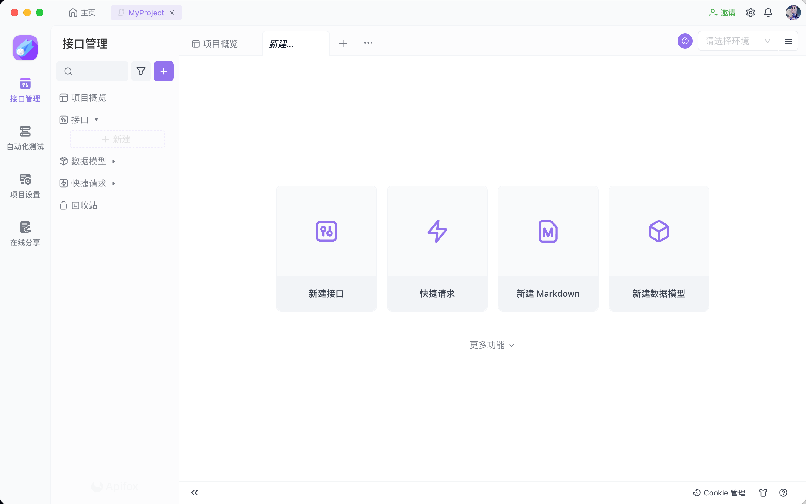

在右上方设置项目的环境，添加服务，被添加的服务会出现在所有环境里，你可以配置对应服务的URL。

对于Mock环境，地址会自动生成。

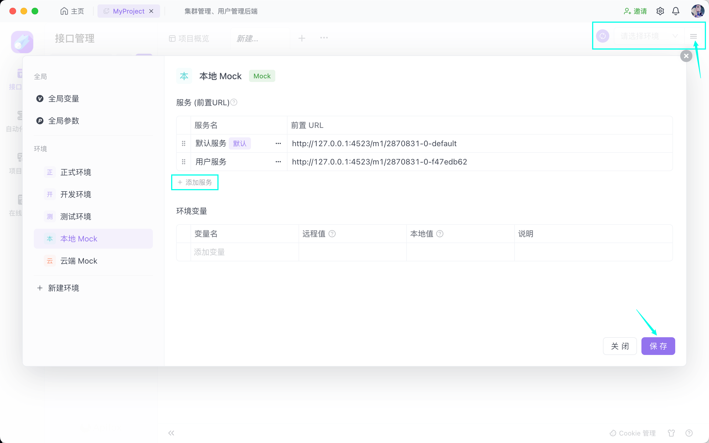

最后效果如图所示。

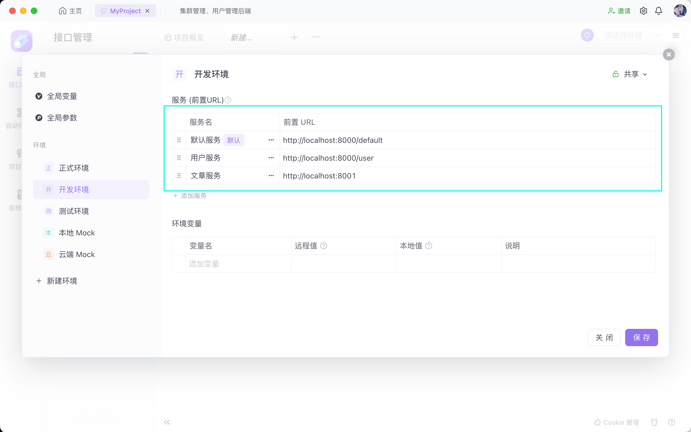

服务建立好后，建立对应的接口子目录，并设置其服务。

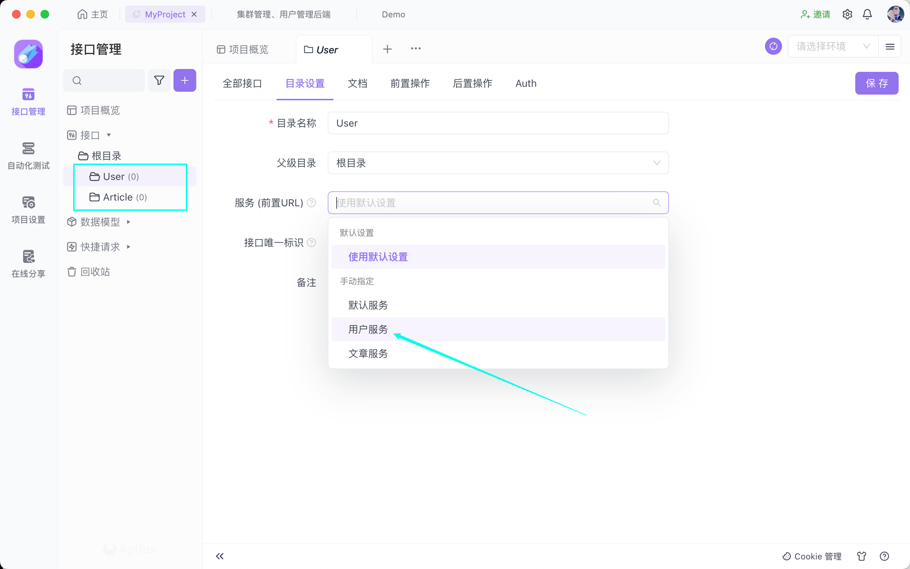

配置目录的Auth方式，Auth会被继承。此处用环境变量中的TOKEN设置Bearer Token。

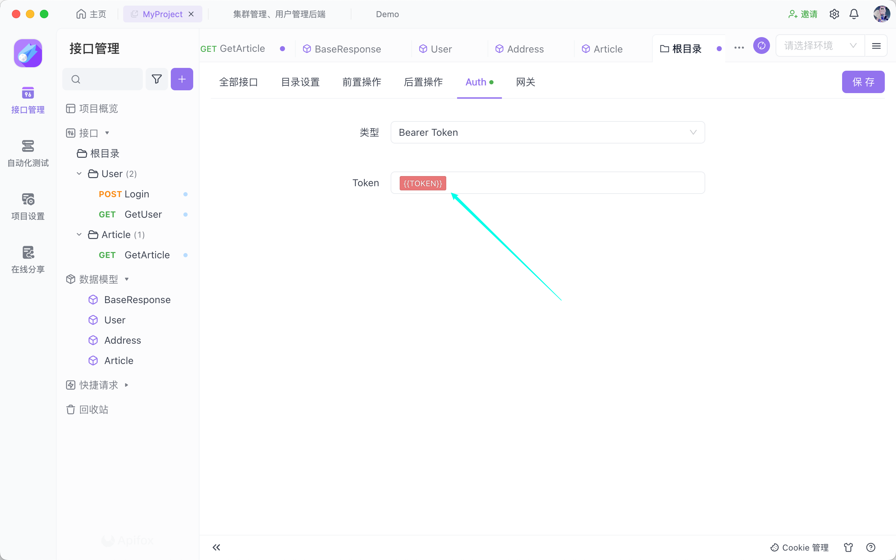

## 接口设计

接下来建立几个相应接口用于演示。

### 数据模型

对于返回响应，一般有统一的格式，不妨提为数据模型-BaseResponse。

其中msg为可选项，此时不妨设置一下Mock。

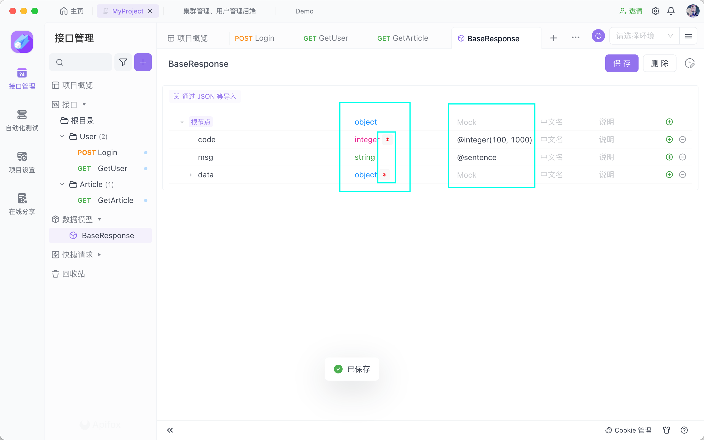

通过该页面的预览功能，可以看到Mock生成的数据。

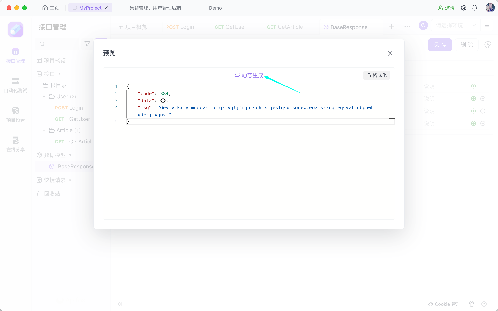

创建数据模型User。将address设置为引用对象Address，以复用定义和Mock。

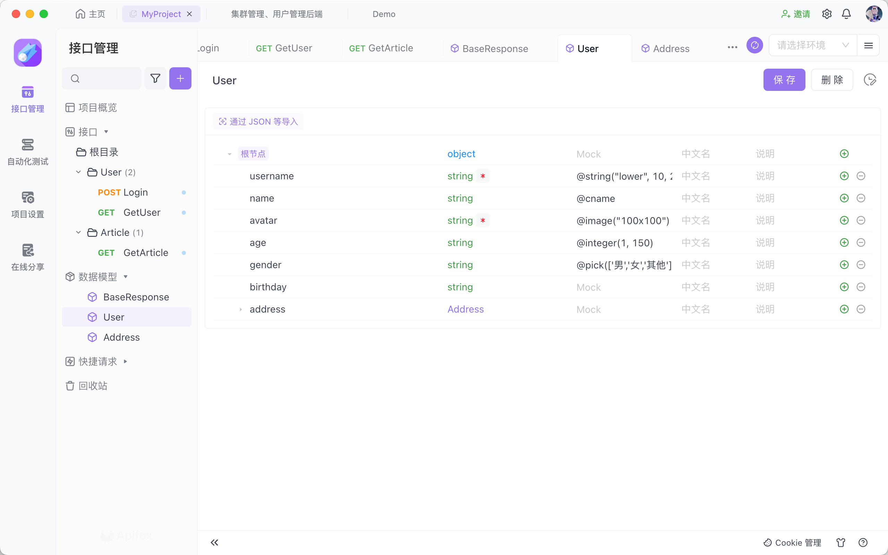

可以看到，Mock智能处理了未指定的字段。

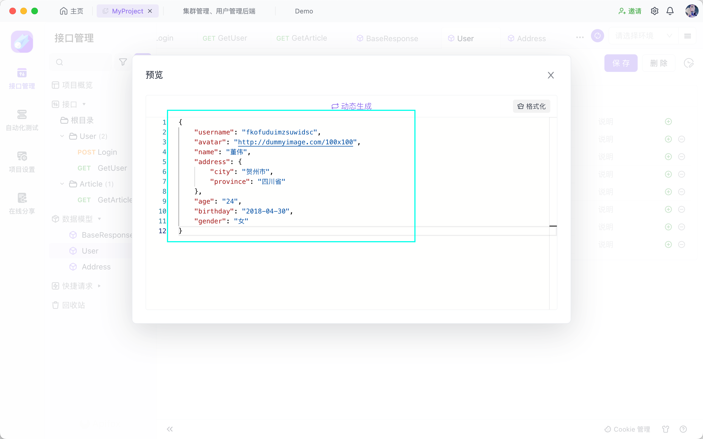

创建数据模型Article。对于引用对象User，隐藏不需要的字段。

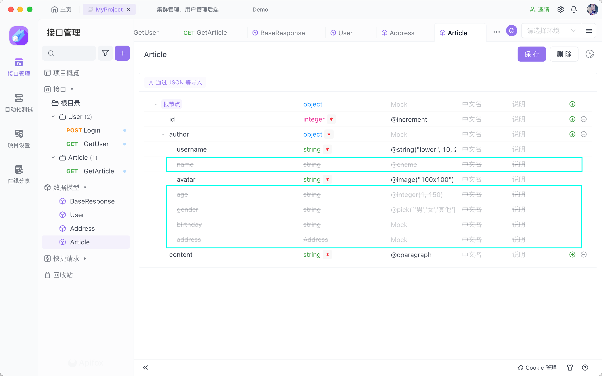

### 接口

#### Login

需要单独对data解除关联，修改使之携带token。

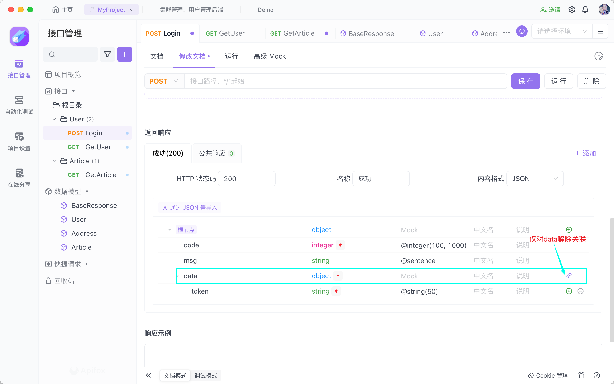

在后置操作中提取token并保存到环境变量以供Auth认证。

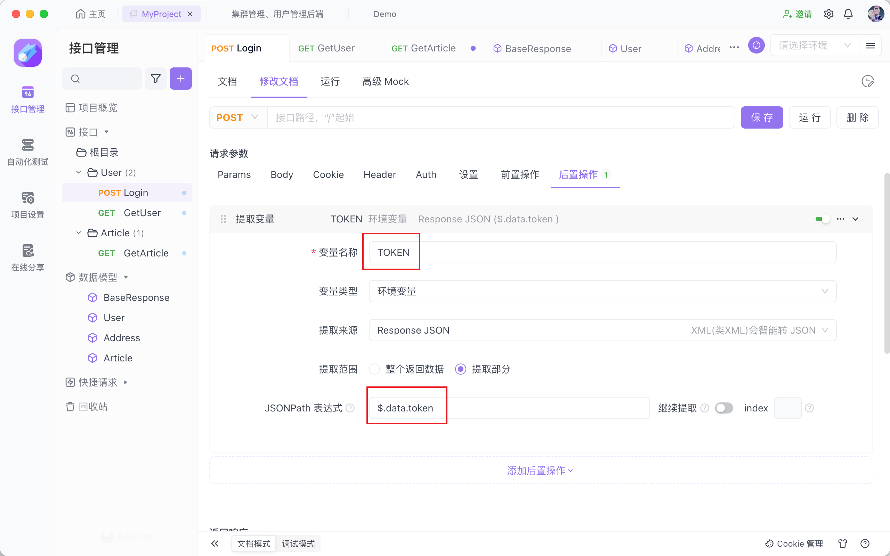

#### GetArticle

也可以在解除关联后修改data为引用类型。

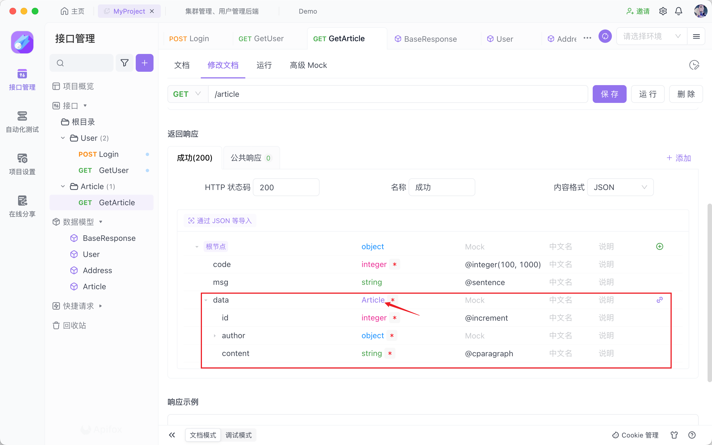

保存后可以直接在浏览器访问本地Mock的URL。

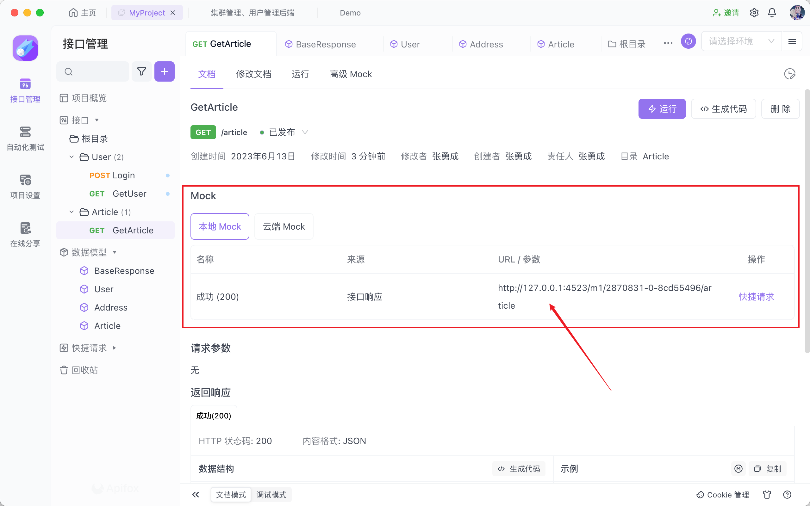

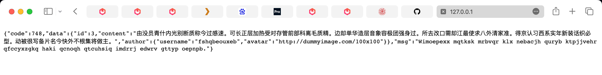

### 尾声

其他功能请进一步查阅Apifox文档。